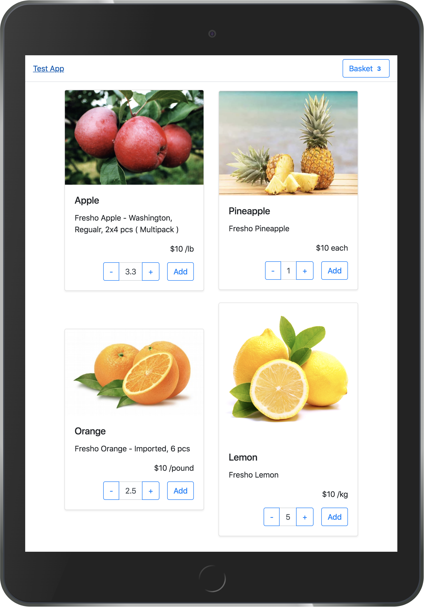
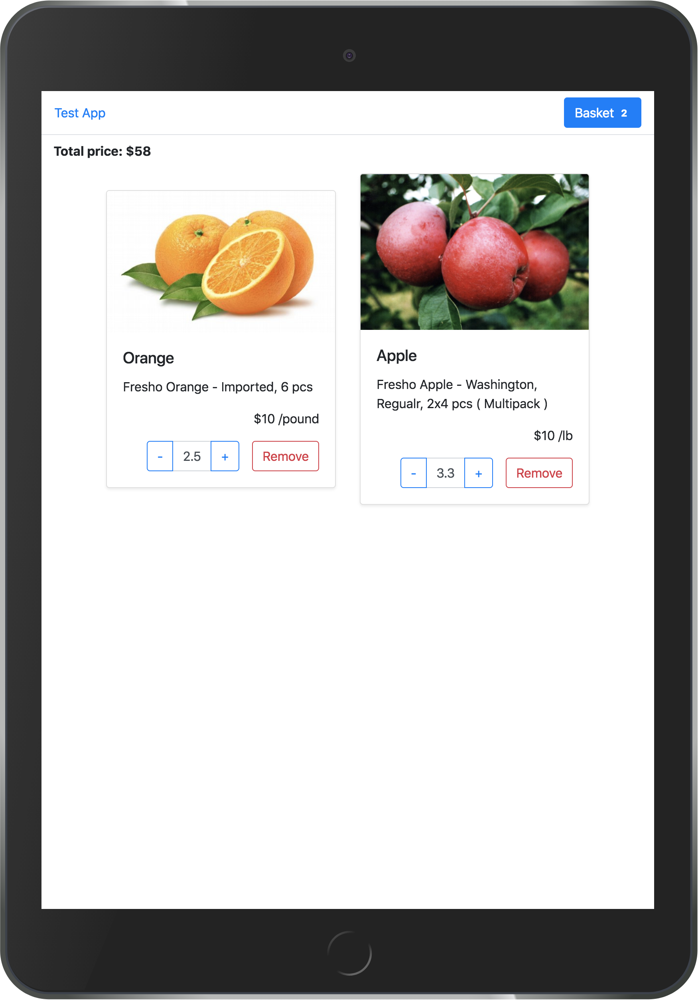

# AngularJS App

### Quick start

```bash
$ git clone https://github.com/AKosmachyov/angularjs-app.git
$ cd angularjs-app
$ npm i
```

#### Start dev server

```bash
npm start
```

:checkered_flag: follow this link [localhost:4000](http://localhost:4000).


### Preview

 
